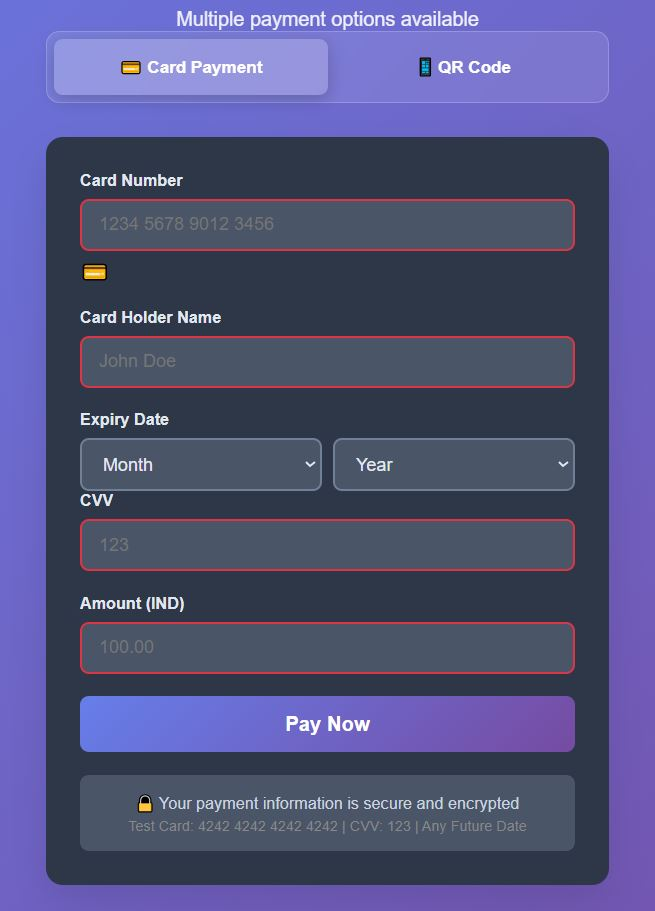

# Payment System



## Overview
Our payment system provides secure and efficient transaction processing.

## Features
- 💳 Multiple payment methods
- 🔄 Recurring payments

## Features
- 💳 Multiple Payment Methods

Credit/Debit Cards (Visa, MasterCard, American Express)
Digital Wallets (PayPal, Apple Pay, Google Pay)
Bank Transfers
Cryptocurrency

## - 🔒 Secure Processing |  SSL encryption

PCI DSS Compliant
End-to-end encryption
Tokenization for sensitive data
3D Secure authentication

 ## - 📊 Real-time analytics | 🌐 Payment Providers
  
Stripe Integration
PayPal Integration
Square Integration
Custom gateway support

## Transaction Management

Real-time payment processing
Refund handling
Subscription management
Invoice generation

## Tips:
1. Use **PNG** for diagrams and screenshots
2. Use **SVG** for scalable graphics
3. Keep image sizes reasonable (<1MB)
4. Use descriptive alt text for accessibility
5. Organize images in an `images/` or `assets/` folder

Choose the method that best fits your project structure!
## Installation
```bash
your-project/
├── README.md
├── images/
│   └── payment-system.png
├── docs/
│   └── assets/
└── src/

